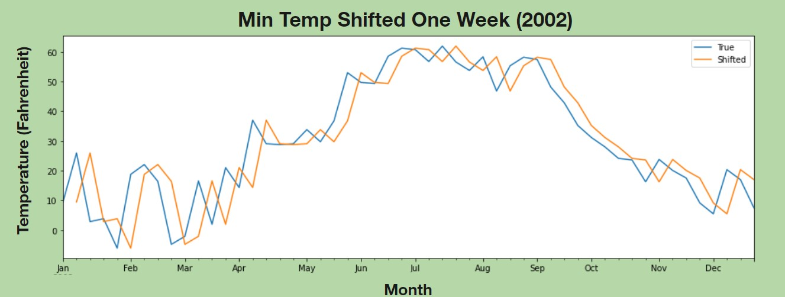
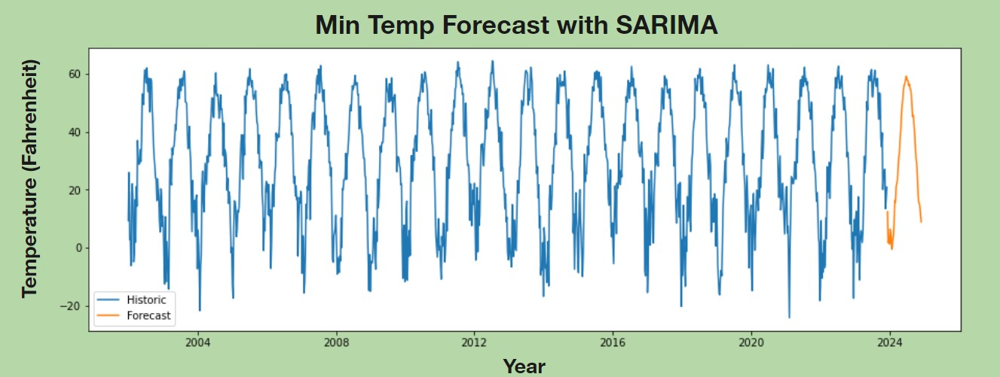

Photo by <a href="https://martinvorel.com/">Martin Vorel</a>
# ND Corn Growth Degree Days Predictor

It’s Corn!

From fuel such as E85, to livestock feed, to sweeteners in your soft drinks, to cosmetics and adhesives, water filtration systems, PLA plastics that are used in 3D printers, a natural herbicide, binders in medications, and of course food, corn is in everything. 

Corn is a nearly $10 billion industry in ND alone. 

## Business Problem

Varieties of corn are optimized for different numbers of growth days. Using weather data from NDAWN, we will produce a time series analysis that can predict weather features for growth days. 

## Data

Twenty-one years of weekly weather data retrieved from the North Dakota Agricultural Weather Network (NDAWN) hosted by NDSU. 

Thirteen factors are included in this data.

- Maximun Temperature
- Mininum Temperature
- Average Temperature
- Average Bare Soil Temperature	
- Average Turf Soil Temperature
- Avg Wind Speed
- Max Wind Speed
- Total Solar Radiation
- Total Penman PET 
- Average Penman PET
- Total Rainfall
- Average Dew Point
- Average Wind Chill


## EDA


The High and Low Temperatures continue in the yearly pattern of the seasons. The range is between 100 and -20 degrees Fahrenheit.


Growing degree day (GDD) accumulations, rather than calendar days, more precisely characterize the length of the growing season. Unlike the number of days between killing frosts, GGDs provide quantitative information about temperature during the growing season. In calculating GDDs for corn, temperatures from a lower limit of 50 degrees and an upper limit of 86 degrees are accumulated for the growing season by applying the formula below to each day’s maximum and minimum temperatures:

Corn GDD=(Maximum temperature + minimum temperature)/2 - 50

Maximum temperatures higher than 86 degrees are entered as 86 and temperatures below 50 degrees are entered as 50 in the formula. GDDs are accumulated from seedling emergence until physiological maturity. 


GDD peaks at about 40 in the summer months and drops to zero near the end of the fall. 

## Modeling




The first simple model is just shifting the values ahead one week as seen in the graphs above. 




The final model was a tuned SARIMA model which accounts for the seasonality better. 

## Prediction


Using the predicted temperatures from the tuned SARIMA model, the Growth Degree Days can be predicted as 3,500 GDD for 2024.

## Appendix

The complete analysis can be found in the <a href="Weather_Forecast_for_Corn_Growth_Degree_Days.ipynb">Jupyter Notebook</a> and in our <a href="Weather Forecast GDD for Corn near Jamestown, ND.pdf">presentation</a>.

## Repository Structure ##

You are in the README.md.  'Weather_Forecast_for_Corn_Growth_Degree_Days.ipynb' contains the jupyter notebook that explains our data science steps for you to replicate. 'Weather Forecast GDD for Corn near Jamestown, ND.pdf' contains our presentation slides that sums up important information for our audience.  In 'Data' you will be able to see the datasets we worked with.  Likewise, 'Images' will contain images used. 


```bash

├── Data                                                    <- Data files used in this project

├── Images                                                  <- Images and Graphs used in this project obtained from external and internal sources

├── .gitignore                                              <- Contains list of files to be ignored from GitHub

├── Weather Forecast GDD for Corn near Jamestown, ND.pdf    <- Slide Presentation of the project

├── README.md                                               <- Contains README file to be reviewed

└── Weather_Forecast_for_Corn_Growth_Degree_Days.ipynb      <- Jupyter notebook of the project containing codes and analysis