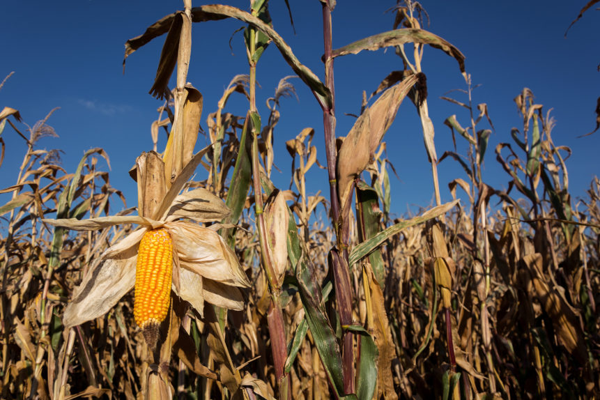

Photo by <a href="https://martinvorel.com/">Martin Vorel</a>
# ND Corn Growth Days Predictor
## Business Problem
Varieties of corn are optimized for different numbers of growth days. Using weather data from NDAWN, we will produce a time series analysis that can predict weather features for growth days. 
## Data

## EDA

## Modeling

## Prediction