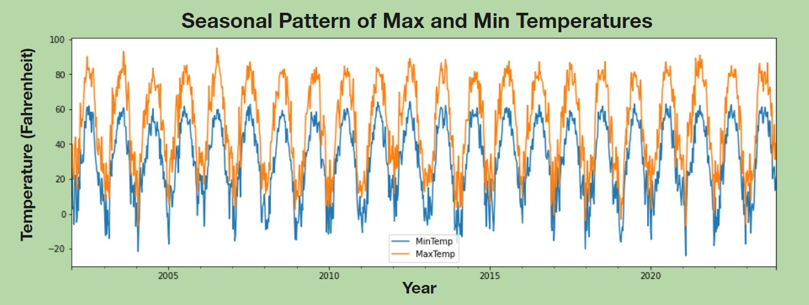
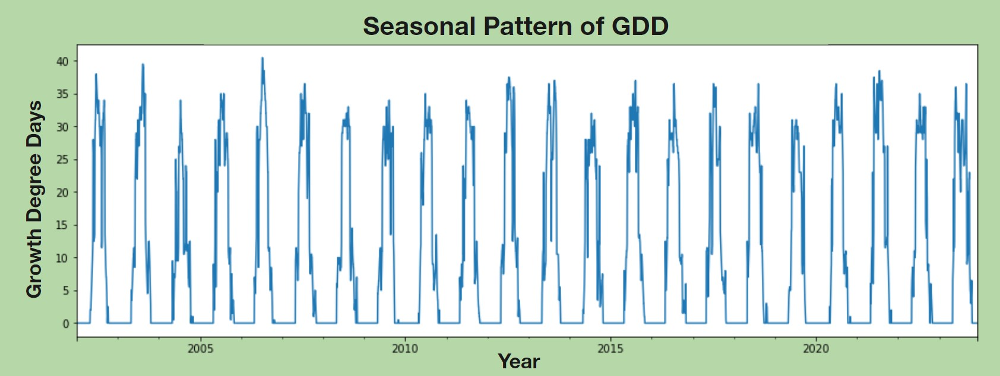
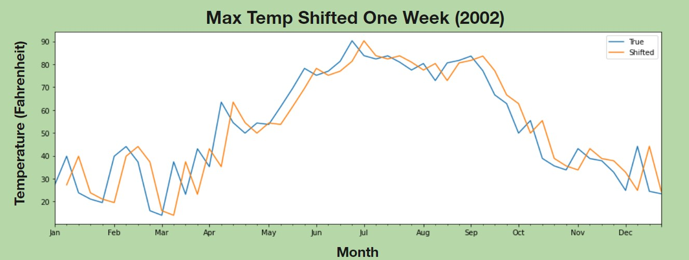
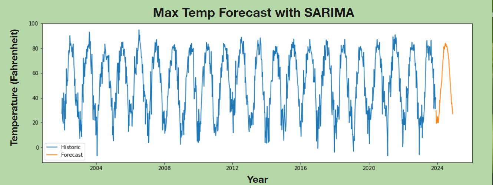
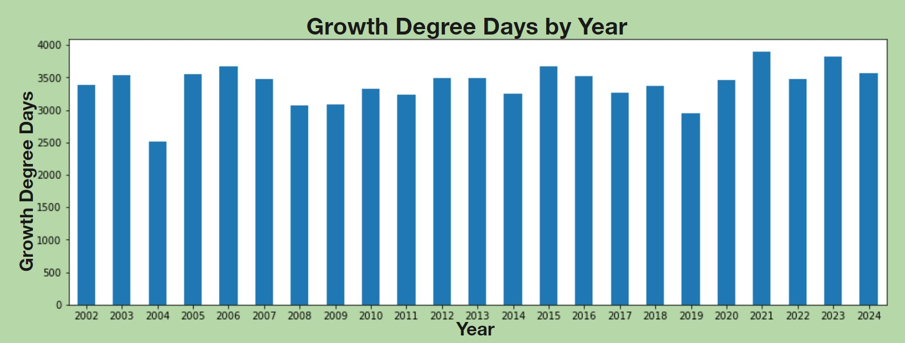

Photo by <a href="https://martinvorel.com/">Martin Vorel</a>
# ND Corn Growth Degree Days Predictor
## Business Problem
Varieties of corn are optimized for different numbers of growth days. Using weather data from NDAWN, we will produce a time series analysis that can predict weather features for growth days. 
## Data
NDAWN by NDSU
21 years of weekly Weather Data
13 unique factors

Limitations
Only Jamestown, ND Weather Station
Weekly averages soften outliers

## EDA

## Modeling

## Prediction
